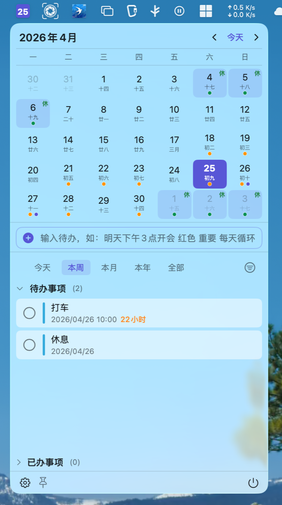
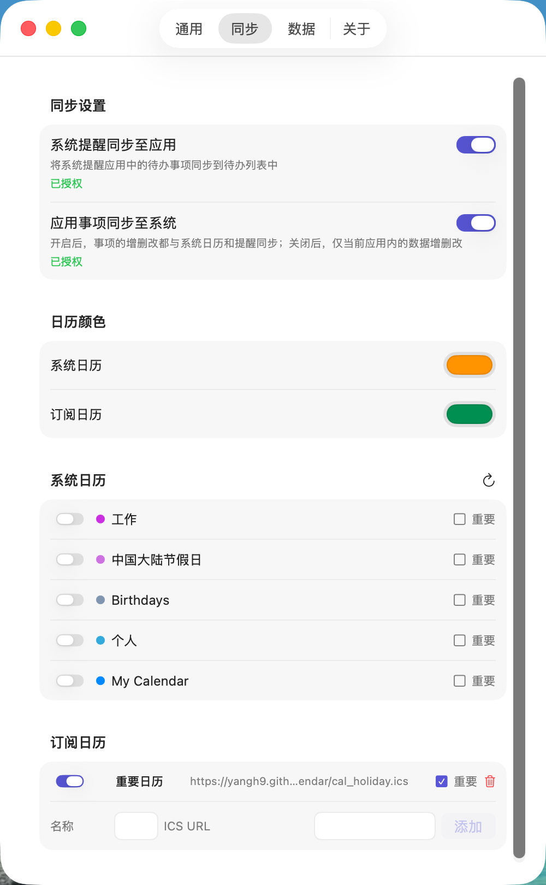
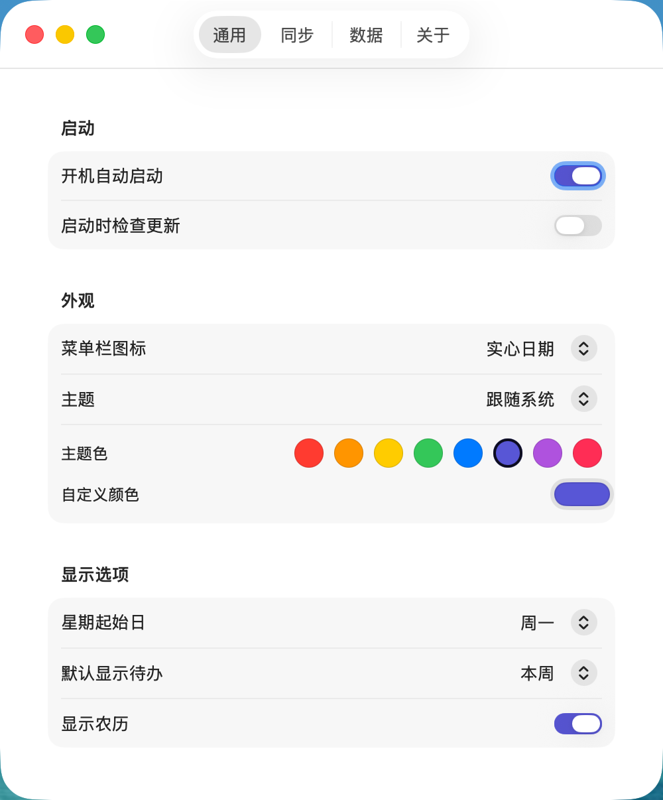
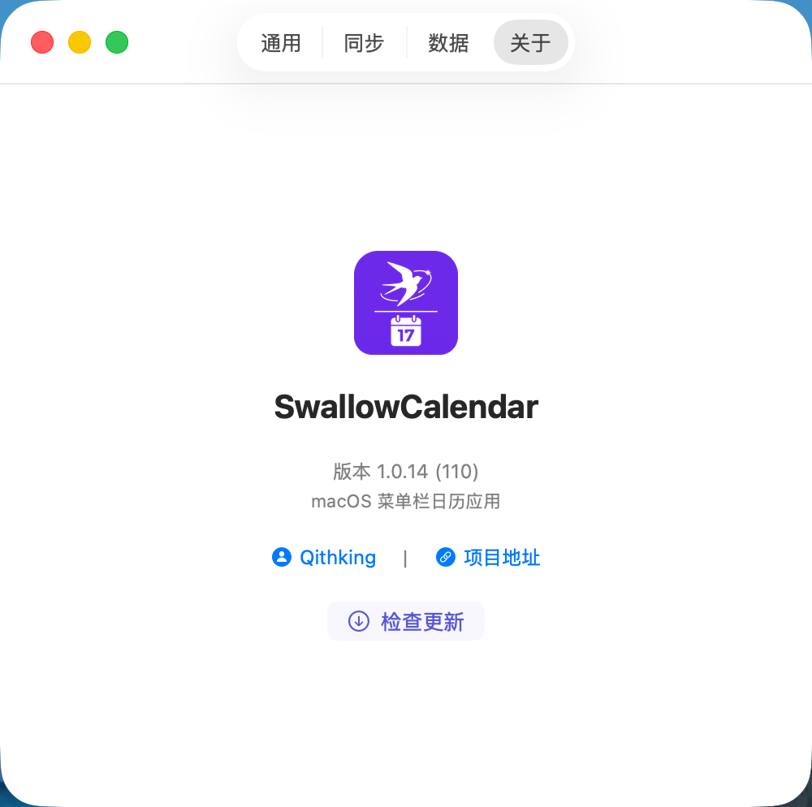
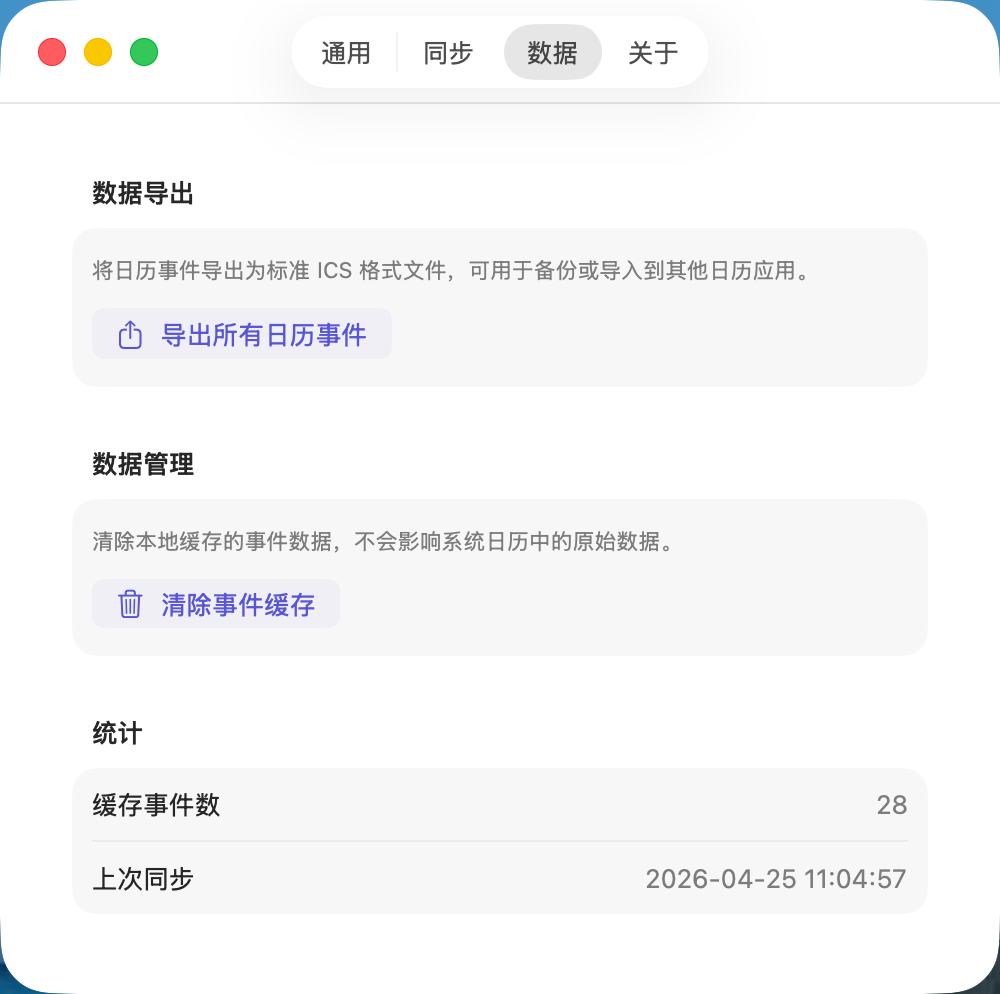

# SwallowCalendar

<p align="center">
  
  
  
  
  
</p>

<p align="center">
  <strong>🕊️ 燕子日历</strong> - 一款简洁优雅的 macOS 菜单栏日历应用
</p>

<p align="center">
  日历 · 农历 · 待办 · 节假日 · ICS订阅
</p>

---

## 📸 界面截图

<table>
  <tr>
    <td></td>
    <td></td>
  </tr>
  <tr>
    <td align="center"><strong>主界面 - 日历与待办</strong></td>
    <td align="center"><strong>日历详情 - 节假日标注</strong></td>
  </tr>
  <tr>
    <td></td>
    <td></td>
  </tr>
  <tr>
    <td align="center"><strong>待办事项管理</strong></td>
    <td align="center"><strong>设置与主题定制</strong></td>
  </tr>
  <tr>
    <td></td>
    <td></td>
  </tr>
  <tr>
    <td align="center"><strong>事件编辑</strong></td>
    <td></td>
  </tr>
</table>

---

## ✨ 功能特性

### 📅 日历功能
- **月历视图** - 直观的月份日历展示，支持日期快速定位
- **农历显示** - 完整支持农历日期展示
- **节假日标注** - 自动识别并标注法定节假日（休/班标记）
- **重要日期** - 支持自定义重要日期高亮显示

### 📝 待办事项
- **自然语言输入** - 智能识别时间、优先级、颜色和循环规则
  ```
  明天上午10点开会           → 创建明天的会议
  下午3点交报告 重要         → 创建带优先级的事件
  每周一晨会 每天循环        → 创建循环任务
  ```
- **智能过滤** - 按时间范围筛选（今天/本周/本月/本年/全部）
- **完成状态** - 标记完成/未完成，自动同步到系统提醒
- **循环任务** - 支持每日/每周/每月/每年循环
- **提醒功能** - 自定义提醒时间，可创建为系统提醒

### 🔗 数据同步
- **系统日历集成** - 与 macOS 系统日历无缝同步，支持双向 CRUD
- **系统提醒同步** - 与 macOS 提醒应用双向同步待办事项
- **ICS 订阅** - 支持订阅外部 ICS 日历（节假日日历等）
- **本地缓存** - 事件数据本地缓存，快速响应

### 🎨 主题定制
- **自定义主题色** - 随心所欲切换应用配色方案
- **菜单栏图标样式** - 多种图标风格可选（实心日期/描边日期/日历图标）
- **毛玻璃背景** - 系统级半透明效果
- **窗口缩放** - 支持自由调整窗口大小，自动保存窗口尺寸

---

## 📦 安装方式

### Homebrew（推荐）

```bash
brew install --cask swallowcalendar
```

### 手动安装

1. 从 [Releases](https://github.com/Qithking/SwallowCalendar/releases) 下载最新版本
2. 解压 `.dmg` 文件
3. 将应用拖入 `应用程序` 文件夹

---

## ⌨️ 快捷键

| 快捷键 | 功能 |
|--------|------|
| `⌘ + ,` | 打开设置 |

---

## 🛠️ 开发指南

### 环境要求

| 工具 | 版本要求 |
|------|---------|
| macOS | 14.0 (Sonoma) 及以上 |
| Xcode | 15.0+ |
| Swift | 5.9+ |
| 架构 | Apple Silicon / Intel |

### 快速开始

```bash
# 克隆项目
git clone https://github.com/Qithking/SwallowCalendar.git

# 进入项目目录
cd SwallowCalendar

# 使用 Xcode 打开
open SwallowCalendar.xcodeproj

# 在 Xcode 中编译运行 (⌘+R)
```

### 项目结构

```
SwallowCalendar/
├── Models/              # 数据模型
│   ├── CalendarEvent.swift
│   ├── CachedEvent.swift
│   ├── CalendarPreference.swift
│   └── CustomCalendarSource.swift
├── Services/            # 核心服务
│   ├── AppDelegate.swift          # 应用代理（状态栏管理）
│   ├── AppSettings.swift          # 设置管理
│   ├── CalendarService.swift      # 日历服务
│   ├── EditEventWindowManager.swift  # 事件编辑窗口管理
│   ├── FloatingPanel.swift        # 可缩放浮动面板
│   ├── ICSService.swift           # ICS 解析服务
│   ├── IconStyle.swift            # 图标样式
│   ├── NLPTaskParser.swift        # 自然语言解析
│   ├── SettingsWindowManager.swift # 设置窗口管理
│   ├── StatusBarIconManager.swift # 状态栏图标管理
│   └── UpdateChecker.swift        # 更新检查
├── Views/               # 界面视图
│   ├── Calendar/        # 日历相关视图
│   ├── Events/          # 事件相关视图
│   ├── Settings/        # 设置页面
│   └── VisualEffectView.swift     # 毛玻璃效果视图
└── Utils/               # 工具函数
    └── LunarCalendarHelper.swift
```

### 主要依赖

- **SwiftUI** - 用户界面框架
- **SwiftData** - 数据持久化
- **EventKit** - 系统日历集成
- **NaturalLanguage** - 自然语言处理

## 🤝 贡献指南

欢迎提交 Issue 和 Pull Request！

### 贡献流程

1. **Fork** 本仓库
2. 创建特性分支 (`git checkout -b feature/AmazingFeature`)
3. 提交更改 (`git commit -m 'Add some AmazingFeature'`)
4. 推送到分支 (`git push origin feature/AmazingFeature`)
5. 创建 **Pull Request**

### 贡献规范

- 遵循 Swift 代码规范
- 添加必要的单元测试
- 更新相关文档

---

## 📄 许可证

本项目基于 [GPLv3 License](./LICENSE) 开源。

---

## 📬 联系方式

- **GitHub**: [Qithking/SwallowCalendar](https://github.com/Qithking/SwallowCalendar)
- **作者**: [Qithking](https://github.com/thking)
- **问题反馈**: [Issues](https://github.com/Qithking/SwallowCalendar/issues)

---

## ☕ 赞助支持

如果你觉得这个项目对你有帮助，欢迎请我喝杯咖啡 ☕

<table>
  <tr>
    <td align="center">
      
      <br>
      <strong>微信支付</strong>
    </td>
    <td align="center">
      
      <br>
      <strong>支付宝</strong>
    </td>
  </tr>
</table>

<p align="center">
  <sub>感谢你的支持！每一笔赞助都是我持续维护和改进的动力 💪</sub>
</p>

---

<p align="center">
  <sub>⭐️ 如果觉得这个项目有帮助，欢迎 Star 支持一下！</sub>
</p>
